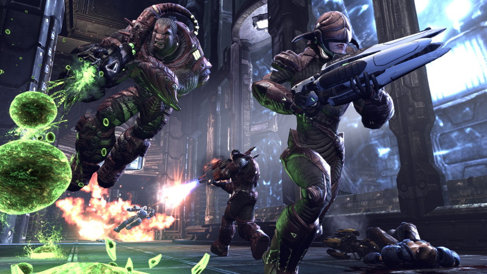

# [Конкурс №160 "Arena Shooter IV"](http://igdc.ru/igdc_top.php?konkurs=160)

Наша тема проста - арена шутеры!

Основные правила:

- Главный герой.
- Враги.
- Стрельба.

Под ареной понимается любое ограниченное пространство.
Для игры можно использовать любой распространенный шутерный режим - десматч (все против всех), команда на команду, удержание точек, захват флага или даже, прости Дейкстра, королевская битва.

Бонусы будем давать за:

- Размер сборки игры меньше 96Kb (98304 байт).
- Сменное оружие, разбросанное по уровню.
- Персонажей с разными нестрелковыми способностями (например - высокие прыжки и установка щита)

Конкурс продлится по 27-е февраля включительно. Ограничение на размер - 50 Мб. Публиковать и показывать предварительные версии работ, исходные коды, материалы разработки - можно и нужно.

P.S. У нас богатая история - можно вдохновляться предыдущими конкурсами.
